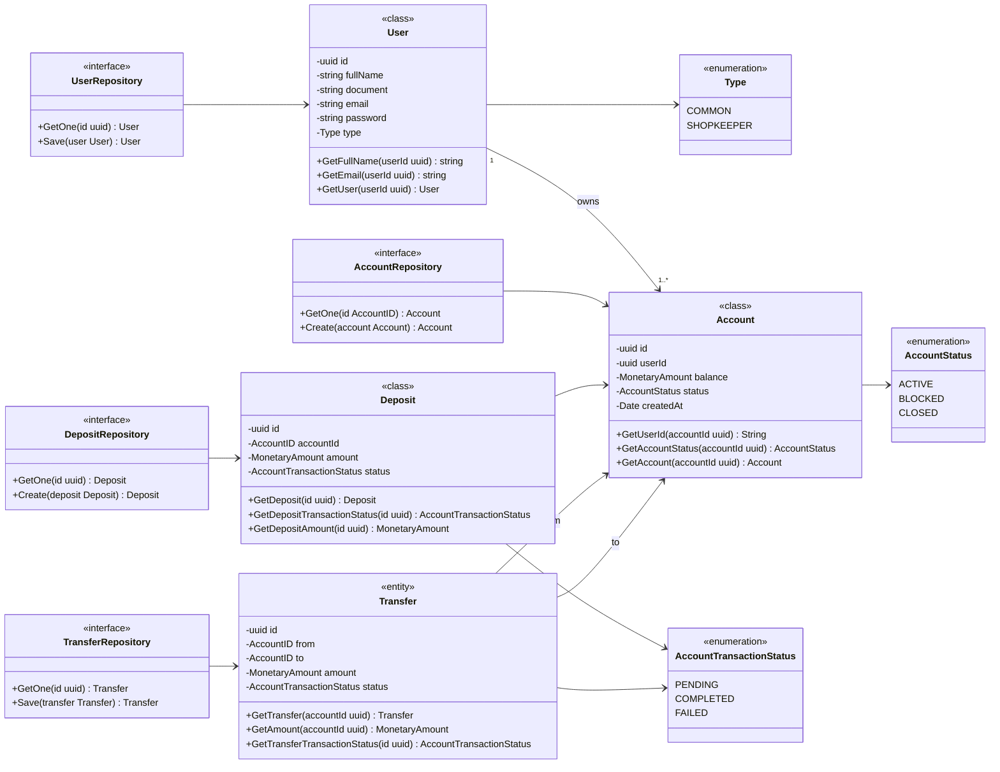

```mermaid
classDiagram
    direction LR

    %% =========================
    %% USER CONTEXT
    %% =========================

    class User {
        <<class>>
        -uuid id
        -string fullName
        -string document
        -string email
        -string password
        -Type type
        +GetFullName(userId uuid) string
        +GetEmail(userId uuid) string
        +GetUser(userId uuid) User
    }

    class UserRepository {
        <<interface>>
        +GetOne(id uuid) User
        +Save(user User) User
    }

    class Type {
        <<enumeration>>
        COMMON
        SHOPKEEPER
    }

    %% =========================
    %% ACCOUNT CONTEXT
    %% =========================

    class Account {
        <<class>>
        -uuid id
        -uuid userId
        -MonetaryAmount balance
        -AccountStatus status
        -Date createdAt
        +GetUserId(accountId uuid) String
        +GetAccountStatus(accountId uuid) AccountStatus
        +GetAccount(accountId uuid) Account
    }

    class AccountRepository {
        <<interface>>
        +GetOne(id AccountID) Account
        +Create(account Account) Account
    }

    class AccountStatus {
        <<enumeration>>
        ACTIVE
        BLOCKED
        CLOSED
    }

    class AccountTransactionStatus {
        <<enumeration>>
        PENDING
        COMPLETED
        FAILED
    }

    %% =========================
    %% DEPOSIT
    %% =========================

    class Deposit {
        <<class>>
        -uuid id
        -AccountID accountId
        -MonetaryAmount amount
        -AccountTransactionStatus status
        +GetDeposit(id uuid) Deposit
        +GetDepositTransactionStatus(id uuid) AccountTransactionStatus
        +GetDepositAmount(id uuid) MonetaryAmount
    }

    class DepositRepository {
        <<interface>>
        +GetOne(id uuid) Deposit
        +Create(deposit Deposit) Deposit
    }

    %% =========================
    %% TRANSFER
    %% =========================

    class Transfer {
        <<entity>>
        -uuid id
        -AccountID from
        -AccountID to
        -MonetaryAmount amount
        -AccountTransactionStatus status
        +GetTransfer(accountId uuid) Transfer
        +GetAmount(accountId uuid) MonetaryAmount
        +GetTransferTransactionStatus(id uuid) AccountTransactionStatus
    }

    class TransferRepository {
        <<interface>>
        +GetOne(id uuid) Transfer
        +Save(transfer Transfer) Transfer
    }

    %% =========================
    %% RELATIONSHIPS
    %% =========================

    User --> Type
    UserRepository --> User

    User "1" --> "1..*" Account : owns
    Account --> AccountStatus
    AccountRepository --> Account

    Deposit --> Account
    DepositRepository --> Deposit
    Deposit --> AccountTransactionStatus

    Transfer --> Account : from
    Transfer --> Account : to
    TransferRepository --> Transfer
    Transfer --> AccountTransactionStatus
```